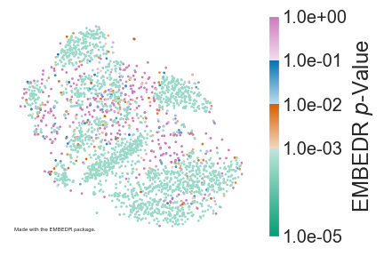

# EMBEDR

Author: Eric Johnson \
Date Created: July 1, 2021 \
Email: eric.johnson643@gmail.com

## Overview

**E**mpirical **M**arginal resampling **B**etter **E**valuates
**D**imensionality **R**eduction, or **EMBEDR**, is a method for evaluating the
extent to which an embedding generated by a dimensionality reduction algorithm
contains structures that are more similar to the structures in the
high-dimensional space than we expect by random chance.  The method applies the
concept of an empirical hypothesis test, where a null distribution for a sample
statistic is generated via marginal resampling, in order to estimate whether
samples are better-embedded than a given DRA might do by chance.

For complete details, see our
[preprint](https://www.biorxiv.org/content/10.1101/2020.11.18.389031v2).

## Installation

To install EMBEDR, we recommend cloning this repository before installing using
`pip` in the main project directory.  Specifically:

```bash
    pip install .
```

The package requires numpy, scikit-learn, scipy, conda, and numba for
installation.  To generate figures, the seaborn package is required. 
Additionally, it is recommended that you ensure that
[fftw](https://www.fftw.org/) is installed, otherwise you will not be able to
use the fast [FIt-SNE](https://github.com/KlugerLab/FIt-SNE) implementation of
the t-SNE algorithm.  You can install fftw using
[homebrew](https://formulae.brew.sh/formula/fftw).

## Getting Started

Once you've installed EMBEDR, you can easily generate an embedding colored by
EMBEDR *p*-value by calling the `fit` method in the EMBEDR class as below:

```python
from EMBEDR import EMBEDR, EMBEDR_sweep
import numpy as np

X = np.loadtxt("./data/mnist2500_X.txt").astype(float)

embObj = EMBEDR()
embObj.fit(X)
embObj.plot()
```



## New in Version 2.0

The updated version of the EMBEDR package better facilitates the EMBEDR 
algorithm as described in 
[our manuscript](https://www.biorxiv.org/content/10.1101/2020.11.18.389031v2) 
by improving the flow of data between stages of the algorithm. In particular, 
we greatly reduce the number of times that kNN graphs and affinity matrices 
are calculated; attemping to re-use calculations as often as possible.

This version of the algorithm also supports the sample-wise specification of
the `perplexity` and `n_neighbors` parameters, which are common hyperparameters
for dimensionality reduction algorithms.

The EMBEDR_sweep object has been implemented.  Users can now execute a sweep
over `perplexity` or `n_neighbors`.  Users can also fit a cell-wise optimal
t-SNE embedding as in Figure 7 of the manuscript.

## New in Version 2.1

The method now supports UMAP, although not to the same level as t-SNE.  It
seems that UMAP will soon be supporting the use of pre-computed kNN graphs,
at which point UMAP and t-SNE will be able to be used interchangably.

A bug where EMBEDR objects could only be reloaded from the original path at
which they were created has been amended and will be backwards compatible with
previous versions.  Objects can now be loaded from any relative path
specification for the project directory.

## To-Do

- Plotting Utility
    - Sweep results:
        - EES vs hyperparameter (null and data)
        - p-Values vs hyperparameter
    - EMBEDR results:
        - color plot by other metadata / supplied array.
- k-Effective Calculator


